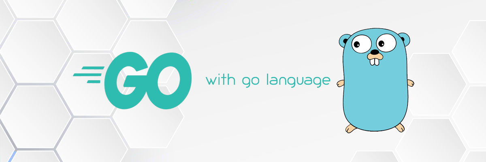

# Hi, I'm Renu 👋🏾 👩🏾‍💻

I'm a software engineer who is passionate about making contributing to open-source more approachable, creating technology to elevate people, and building community. Some technologies I enjoy working with include ReactJS, Jamstack (JavaScript, APIs + Markup) and GraphQL.

## Find me around the web 🌎: 

<ul>
<li> Sharing my Personal thoughts on <a href="https://shethepride.godaddysites.com/">SheThePride</a>✍🏾</li>
<li> Sharing my Professional thoughts on <a href="https://www.linkedin.com/in/renu-p/">LinkedIn</a> 💼</li>
</ul>

